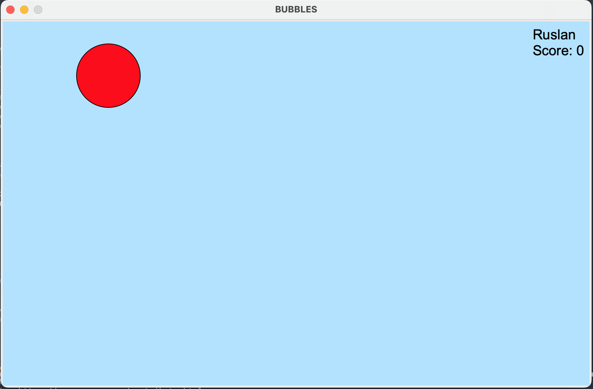

# BUBBLES

_This is a simple **game** implemented on **Python3** demonstrating capabilities of built-in (Python 3.12) **tkinter** library._

## Game process
The goal of the game is to pop a bubbles that appear in random location. Smallest bubbles gives you 7 points, small bubbles 5 points, medium bubbles 2 points and the biggest one gives you 1 point. A transparent bubbles reduce your score by 5. You can use pause function pressing \<space> during the game. The game finishes with 'win' when you get 35 score or 'lose' if you miss the bubble. 
***

## Technical arrangements
To execute the game you should have installed **Python interpreter starting version 3.12**. This project uses **[uv](https://docs.astral.sh/uv/)** for dependency management. To install dependencies run: `uv sync`. For some Linux users may be necessary to install Tcl/Tk on your system, because some Linux distributions separate Tcl/Tk library from default Python. In that case you can install it by executing command in your terminal: `sudo apt install python3-tk`
For storing players scores it uses Python **sqlite3** library, that is already included in your Python release.
***

## Start the game
To start the game you should **run the main.py script**. You can do that in your terminal (or command line shell in Windows): `uv run main.py`

## Build a single distributable executable
PyInstaller is the simplest path for this project (Tkinter + pygame).

1. Install build tooling:
   `uv sync --group dev`
2. Build one-file executable:
   `uv run pyinstaller --clean --noconfirm main.spec`

Build output:
- macOS/Linux: `dist/bubbles`
- Windows: `dist/bubbles.exe`

Notes:
- Build on each target OS (PyInstaller does not cross-compile between macOS/Windows/Linux).
- Game assets are bundled into the executable.
- The score database is stored in a user-writable app data directory when running bundled builds.

## Addition developer notes
main_historic.py is the original procedural version of the game, kept for reference.

## License
MIT

***
&copy; Developed by Ruslan Mansurov 
